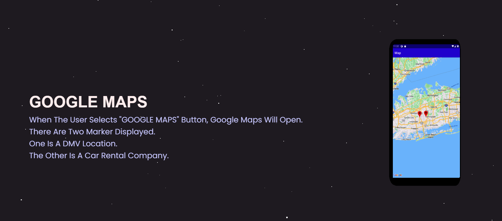

# Contact-Information-Android-App-
## Website Link [Click Here](https://contact-app-android.netlify.app/)  

### Website Description
- This android app was built using Android Studio.
- The app allows users to enter contact information. Based on users age the app will return information such as: can the user drive, vote, and rent a car.  
- The information is stored in a database. SQLite database was used.  
- Google Maps API was added. This allows users to use Google Maps through the app. When Google Maps opens up, both a car rental company and a dmv location are added.
- Three.js was used for the website.
- The phone model was created in blender.

